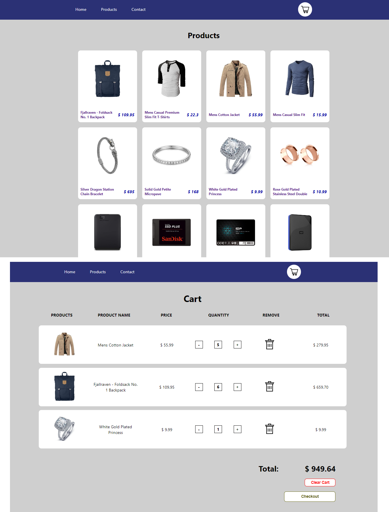

# E-Commerce-React
## Html - Css - JavaScript - React - TypeScript - React Router - React Hooks - Context API - Fake Store API

# Português:
# Projeto de E-Commerce com React
Um projeto simples de e-commerce desenvolvido para praticar o React, apresentando páginas de produtos, um carrinho de compras, um carrossel (sem o uso de bibliotecas externas) e uma página de contato.

## Recursos:
- Páginas de Produtos: Explore uma variedade de produtos obtidos da Fake Store API.
- Carrinho de Compras: Adicione produtos ao seu carrinho e gerencie sua lista de compras.
- Carrossel: Um carrossel personalizado para uma experiência de usuário aprimorada.
- Página de Contato: Entre em contato com o desenvolvedor por meio da página de contato.

## Tecnologias Utilizadas:
- React
- Typescript
- React Router
- React Hooks
- Context API

Confira o projeto aqui:
https://ramonmaximiliano.github.io/e-commerce-react/

# English:
# E-Commerce Project with React
A simple e-commerce project developed to practice React, featuring product pages, a shopping cart, a carousel (without the use of any external libraries), and a contact page.

## Features:
- Product Pages: Browse through a variety of products retrieved from the Fake Store API.
- Shopping Cart: Add products to your cart and manage your shopping list.
- Carousel: A custom-built carousel for an enhanced user experience.
- Contact Page: Get in touch with the developer via the contact page.

## Technologies Used:
- React
- Typescript
- React Router
- React Hooks
- Context API

Check the project here:
https://ramonmaximiliano.github.io/e-commerce-react/

